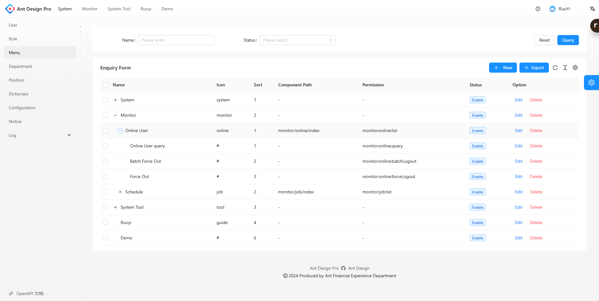
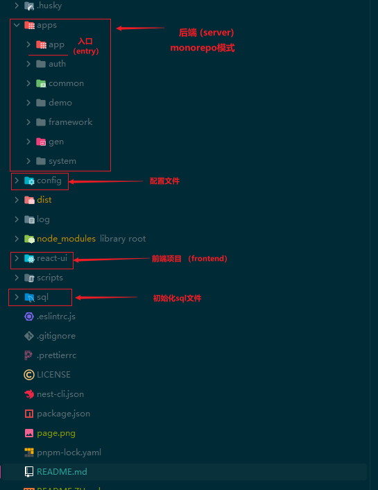

Language : [EN](./README.md) | 中

<p align="center">
  <a href="https://nestjs.com">
    <picture>
      <source media="(prefers-color-scheme: dark)" srcset="https://nestjs.com/logo-small-gradient.76616405.svg">
      
    </picture>
    <h1 align="center">Ruoyi-Nest-React</h1>
  </a>
</p>

一款基于 Nestjs 最新版本的开箱即用的中后台管理系统.



# 说明
## 项目描述
若依(Ruoyi-nest-react)是一套全栈开源的快速开发平台。实现了代码生成,i18n,
若依权限校验,操作日志,动态菜单等功能。后端项目结构参考springboot聚合工程，
采用controller,service,dao三层结构  
多适用于node全栈同学使用

前端使用：React18,Umi4,Ant Design Pro 6  
后端使用：Nestjs Monorepo架构模式  
三方依赖： Mysql Redis (版本建议mysql8+, redis6+)

## 功能描述
1.若依项目相关功能   
2.使用AsyncLocalStorage实现异步上下文追踪

## 初始化项目
（Node版本建议18+,包管理使用pnpm）  

1.拉取项目到本地  

2.初始化数据库，sql文件分为中文和英文，根据需要  

3.config/development.js文件中配置mysql和redis

4.安装依赖，运行项目，初始化用户名密码 admin/admin123

5.react-ui为前端项目，单独安装依赖运行

nest相关
```angular2html
创建新模块
    1.nest generate app newModule
    2. app.module.ts中引入模块
```


## 感谢
1.前端基于 https://gitee.com/whiteshader/ruoyi-react 项目前端修改  
2.后端参考 https://gitee.com/tao-zhi/nest-admin 项目部分代码


## 演示图
<table>
    <tr>
        <td></td>
        <td></td>
    </tr>    
    <tr>
        <td></td>
        <td></td>
    </tr>
    <tr>
        <td></td>
        <td></td>
    </tr>
    <tr>
        <td></td>
        <td></td>
    </tr>
	<tr>
        <td></td>
        <td></td>
    </tr>
	<tr>
        <td></td>
        <td></td>
    </tr>
    <tr>
        <td></td>
        <td></td>
    </tr>
	<tr>
        <td></td>
        <td></td>
    </tr>
</table>
